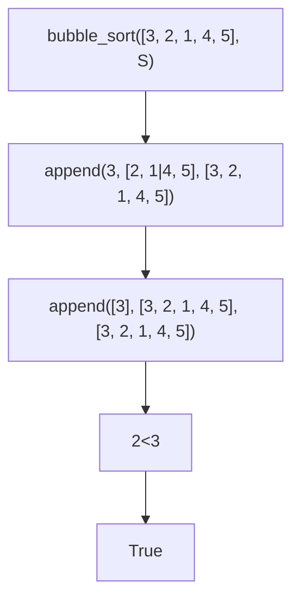

```mermaid
graph TB
    C11["bubble_sort([3, 2, 1, 4, 5], S)"]
    C12["append(3, [2, 1|4, 5], [3, 2, 1, 4, 5])"]
    C13["append([3], [3, 2, 1, 4, 5], [3, 2, 1, 4, 5])"]
    C14["2<3"] --> True
    C11 --> C12 --> C13 --> C14
```