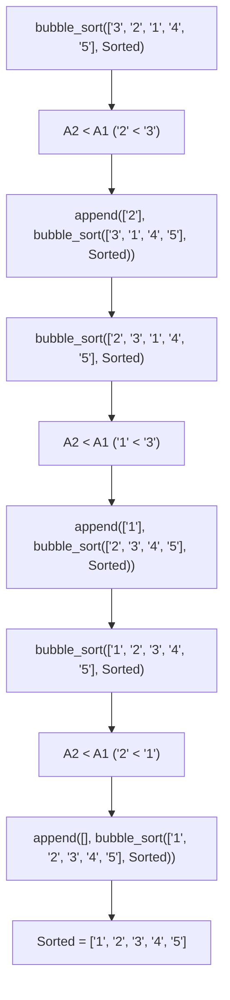

```mermaid
graph TB
    A["bubble_sort(['3', '2', '1', '4', '5'], Sorted)"] --> B["A2 < A1 ('2' < '3')"]
    B --> C["append(['2'], bubble_sort(['3', '1', '4', '5'], Sorted))"]
    C --> D["bubble_sort(['2', '3', '1', '4', '5'], Sorted)"] --> E["A2 < A1 ('1' < '3')"]
    E --> F["append(['1'], bubble_sort(['2', '3', '4', '5'], Sorted))"]
    F --> G["bubble_sort(['1', '2', '3', '4', '5'], Sorted)"] --> H["A2 < A1 ('2' < '1')"]
    H --> I["append([], bubble_sort(['1', '2', '3', '4', '5'], Sorted))"]
    I --> J["Sorted = ['1', '2', '3', '4', '5']"]
```