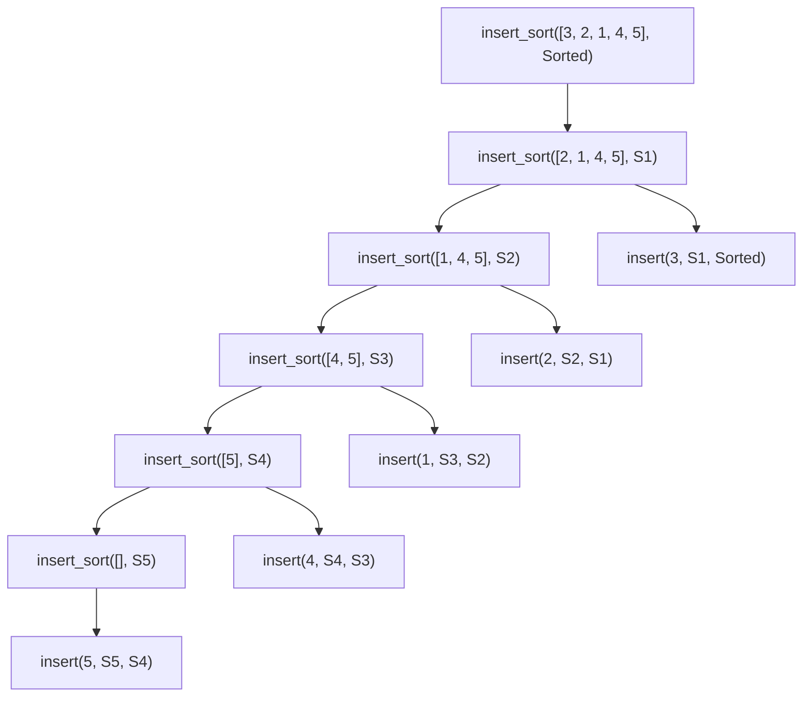

```mermaid
graph TD
    A["insert_sort([3, 2, 1, 4, 5], Sorted)"]
    B["insert_sort([2, 1, 4, 5], S1)"]
    C["insert_sort([1, 4, 5], S2)"]
    D["insert_sort([4, 5], S3)"]
    E["insert_sort([5], S4)"]
    F["insert_sort([], S5)"]
    G["insert(3, S1, Sorted)"]
    H["insert(2, S2, S1)"]
    I["insert(1, S3, S2)"]
    J["insert(4, S4, S3)"]
    K["insert(5, S5, S4)"]
    A --> B
    B --> C
    C --> D
    D --> E
    E --> F
    B --> G
    C --> H
    D --> I
    E --> J
    F --> K
```