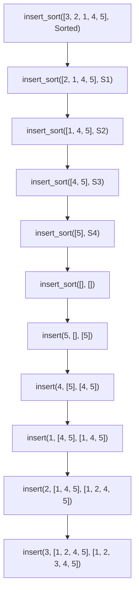

```mermaid
graph TD;
    A["insert_sort([3, 2, 1, 4, 5], Sorted)"] --> B["insert_sort([2, 1, 4, 5], S1)"]
    B --> C["insert_sort([1, 4, 5], S2)"]
    C --> D["insert_sort([4, 5], S3)"]
    D --> E["insert_sort([5], S4)"]
    E --> F["insert_sort([], [])"]
    F --> G["insert(5, [], [5])"]
    G --> H["insert(4, [5], [4, 5])"]
    H --> I["insert(1, [4, 5], [1, 4, 5])"]
    I --> J["insert(2, [1, 4, 5], [1, 2, 4, 5])"]
    J --> K["insert(3, [1, 2, 4, 5], [1, 2, 3, 4, 5])"]
```