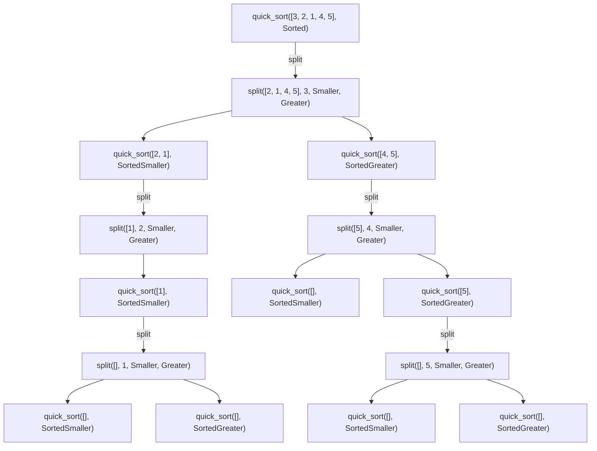

```mermaid
graph TD
    A["quick_sort([3, 2, 1, 4, 5], Sorted)"] -->|split| B["split([2, 1, 4, 5], 3, Smaller, Greater)"]
    B --> C["quick_sort([2, 1], SortedSmaller)"]
    C -->|split| D["split([1], 2, Smaller, Greater)"]
    D --> E["quick_sort([1], SortedSmaller)"]
    E -->|split| F["split([], 1, Smaller, Greater)"]
    F --> G["quick_sort([], SortedSmaller)"]
    F --> H["quick_sort([], SortedGreater)"]
    B --> I["quick_sort([4, 5], SortedGreater)"]
    I -->|split| J["split([5], 4, Smaller, Greater)"]
    J --> K["quick_sort([], SortedSmaller)"]
    J --> L["quick_sort([5], SortedGreater)"]
    L -->|split| M["split([], 5, Smaller, Greater)"]
    M --> N["quick_sort([], SortedSmaller)"]
    M --> O["quick_sort([], SortedGreater)"]
```